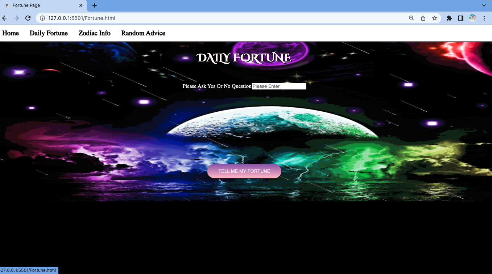
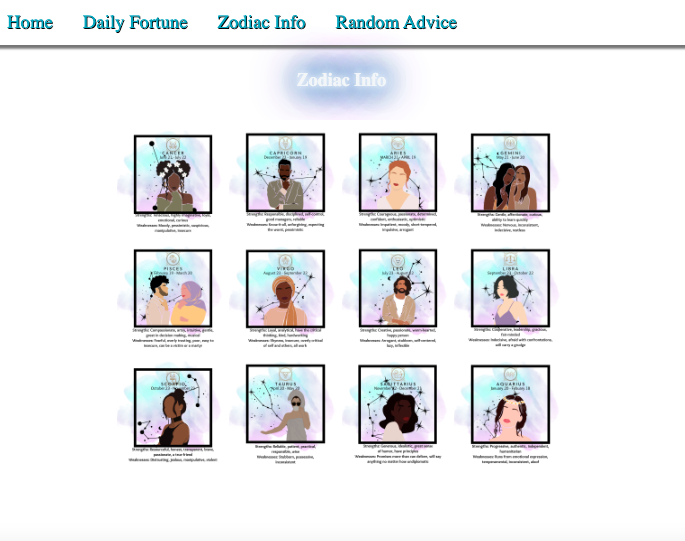

# Front-end Portfolio Project

My portfolio project is me having a lot of fun with css which I don't tend to use that often. 

---

As a user You will be able to:

- See a moving image upon visitng the landing page.

- Navigate through four links with four different purposes.

- If you select Random Advice you will be taken to a new page where I retrieve a response from the API which will then be locked to save usage.

- If you choose Zodaic info you will be taken to a page with 12 buttons describing the signs. 

- If you select Fortune you will be able to ask a yes or no question for a fortune. 

-  All pages must have some visual changes that occur when the screen is a different size.

### Getting started

1. Fork and clone this repository.

1. Navigate to the lab and open live server for implementation. 
